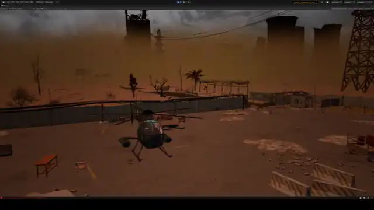
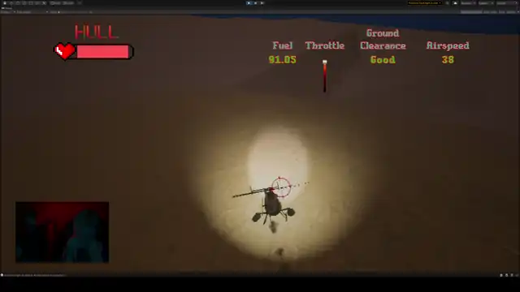
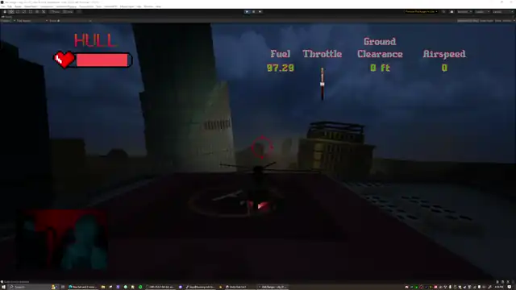

---
# Feel free to add content and custom Front Matter to this file.
# To modify the layout, see https://jekyllrb.com/docs/themes/#overriding-theme-defaults
title: Lonesome Wastes
layout: default
---
# Lonesome Wastes
### Built in Unity - Early Prototype

[Videos](/lonesome_wastes/lw_videos) 
[Images](/lonesome_wastes/lw_images)

---

## Development Notes

- With a focus on game and systems design and aesthetics for the prototype, create original C# code for all game logic and game systems, while leveraging and modifying 3rd party tools and code for some of the more technical but less design-focused elements such as the helicopter flight controller for Lonesome Wastes.

- Original sound effects and music.

- Art assets primarily external, from Unity Asset Store or CGTrader or Itch.io. Original animations.

- Using [HPSXRP](https://github.com/pastasfuture/com.hauntedpsx.render-pipelines.psx) custom render pipeline from pastafuture.

- Most of my time spent during prototyping was to determine performance demands, explore aesthetic styles and intricacies of the custom render pipeline, and validate game and systems design while learning essential tools and processes.

---
## Home Base
{:style="display:block; margin-left:auto; margin-right:auto;"}

Refuel and strategically pick your next destination

You only have so much time in the day to explore before needing to refuel or rest

 

---

## Flight
{:style="display:block; margin-left:auto; margin-right:auto;"}

One hit to the rotors is the end for you. Be careful when performing dangerous maneuvers!

 

---

## Exploring The Old World
{:style="display:block; margin-left:auto; margin-right:auto;"}

Find tools and supplies or perhaps allies while searching through the crumbled remnants
